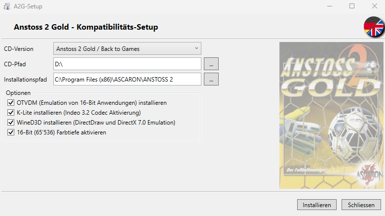

# A2G-Setup
Compatibility setup for a variety of Anstoss 2 Gold (A2G) releases.

This tool allows you to easily install various releases of Anstoss 2 Gold on modern systems (supporting Windows 7 up to the latest Windows releases). It completely automates the notoriously difficult compatibility process by handling OS version spoofing, 16-bit color mode configuration, and the installation of required legacy codecs and DirectDraw wrappers.

**Built entirely on .NET Framework 4.0**, A2G-Setup runs natively out of the box on Windows 7 and newer. You do not need to download or install any additional runtimes or dependencies to run this setup.

---

## 🚀 How to Use

1. **Download** the latest release of A2G-Setup from the [Releases](../../releases) page.
2. **Mount or Insert** the CD/ISO containing your Anstoss 2 Gold setup files, or extract the files into a folder on your system.
3. Open A2G-Setup, select your specific **A2G Release Version** from the dropdown menu, and point the tool to the path where your setup files are located.
4. Click **Install**. The setup will automatically handle the game installation, extract the necessary tools, and configure all system registry flags for you.

> ⚠️ **Note for Windows 7 Users:** > Windows 7 does not support applying a 16-bit color compatibility flag directly to an executable. Whenever you want to play the game, you must manually change your monitor's display settings to 16-bit (High Color) mode.

---

## 📦 Embedded Dependencies

To make the installation process seamless, this setup bundles several open-source tools and legacy binaries. The installer will automatically deploy these components as needed:

* **[WineVDM (otvdm)](https://github.com/otya128/winevdm)**
  Required to run the original 16-bit InstallShield setup files and legacy game binaries natively on modern 64-bit Windows environments.

* **[WineD3D For Windows](https://fdossena.com/?p=wined3d/index.frag)**
  Translates legacy DirectDraw/Direct3D calls into modern graphics APIs to prevent rendering glitches. *Note: Version 7.8 staging is used, as it is the last release to retain Windows 7 compatibility.*

* **[K-Lite Codec Pack](https://codecguide.com/)**
  A customized, basic unattended installation is used. It exclusively installs the CodecTweakTool, MediaInfo, and fixes for BrokenCodecs and BrokenFilters to ensure the game's media playback doesn't crash the system.

* **[Indeo Video Codecs](https://github.com/Bladez1992/Indeo-Video-Codecs)**
  The original Intel Indeo binaries. These are copied to the Windows `SysWOW64` directory and registered if they are not already present on the system, allowing the in-game videos to play correctly.

---

## ⚖️ Licensing & Third-Party Notices

A2G-Setup is licensed under the GNU General Public License v3.0. 

However, this installer embeds third-party binaries required for game compatibility. These components are redistributed strictly for preservation and compatibility purposes and are subject to their own respective licenses:

- **WineVDM (otvdm):** Licensed under the GNU LGPL v2.1 / GPL v2 or later.
- **WineD3D:** Licensed under the GNU Lesser General Public License v2.1.
- **K-Lite Codec Pack Tools:** Copyright (c) Codec Guide. Distributed as freeware.
- **Intel Indeo Codecs:** Copyright (c) Intel / Ligos Corporation. Legacy abandonware included for OS compatibility.